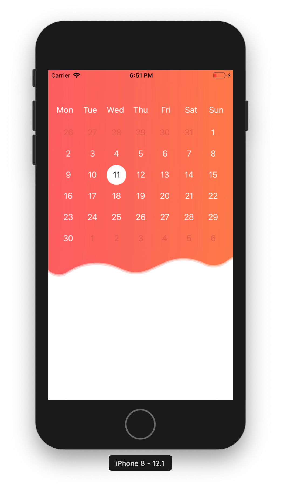

# Alcohol Diary

I wanted to be able to track my alcohol consumption and to get trends of my
drinking. There were a lot of apps out there but none really made me satisfied
so I decided to learn som Swift and iOS programming.

## Features

### Current

* A third party calendar for 2018 which is scrollable and buggy.

### Future

* Keep track of your drinking in real time. Easily add new drinks and see how
  they affect the amount of alcohol in your body.
* See trends over time, get an idea of how much you've been drinking the last
  1, 7, 14, 30 etc days.
* Based on an lump sum, see how much money is spent on drinking.

## Progress

Current version is version zero alpha 0.1. I'm keeping track of the phases the
application has been through.

## Develop, build or test

This project uses
[JTAppleCalendar](https://github.com/patchthecode/JTAppleCalendar) which is
being distributed with [CocoaPods](https://cocoapods.org/).
